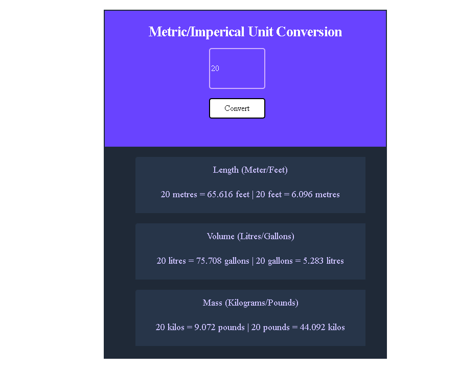

# UNIT CONVERTER
It generates all the conversions when the user clcks the convert button and it converts both metric and imperical values such as:
- Length
- Volume
- Mass

#### Screenshot of the unit convertor I was able to come up with

## LEARN MORE
Head over to (https://scrimba.com/allcourses) to see such courses and try other challenges

## TRY IT OUT!

## Author
- Github - [@Lornzyy](https://github.com/Lornzyy/)
- Twitter - [@Lornzyy](https://www.twitter.com/Lornzyy)
