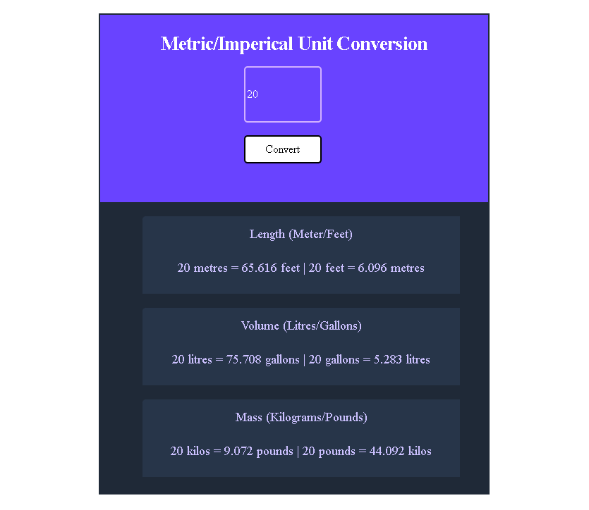

# UNIT CONVERTER

It converts both metric and imperical values such as
- [Length]
- [Volume]
- [Mass]

### Screenshot of the random password generator I was able to come up with

- [Scrimba] Head over to (https://scrimba.com/allcourses) to see such courses and try other challenges

Try it Out!

##
Author
- [Github] (https://github.com/Lornzyy/)
- Twitter - (https://www.twitter.com/Lornzyy)
